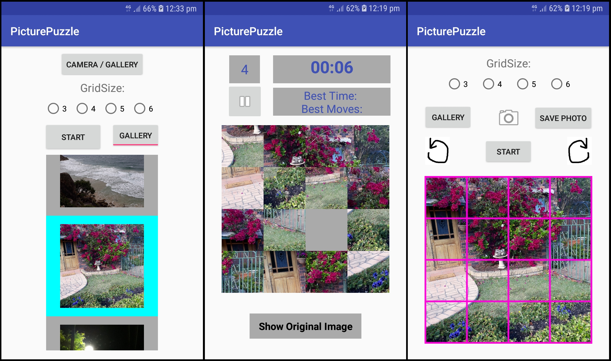

# PicturePuzzle
A simple sliding puzzle app for android. Take a photo or choose one from gallery to crop and load as your image, or 
choose from some default images. A timer and move counter track stats, and the lowest amount of moves and time taken to 
complete the puzzle is saved and displayed. Move individual cells with a tap or slide rows/columns, view the original
image over the puzzle grid for reference, pause and resume the game at will.
- Designed for and tested only on devices with dimensions: 720 x 1280 pixels, 16:9 ratio (or lager).
- Cropping requires a device compatible with the intent, "com.android.camera.action.CROP". (Will give a prompt where user can    choose the default camera app, which usually has this cropping intent)
- Minimum SDK required: 17.
- ImageAdapter.java and game_test.java are old files which are unused in the app.

##### Sample images of MainActivity, PuzzleActivity, PhotoCropper:

