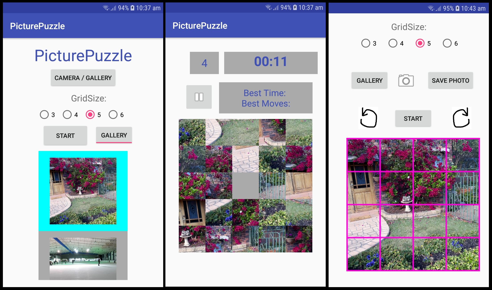

# PicturePuzzle
A simple sliding puzzle app for android, take a photo to load as your picture or choose from some default images. 
Saves the lowest amount of moves and time taken to complete the puzzle. Can pause and resume the game, but can not save a game state.
- Designed for and tested only on devices with dimensions: 720 x 1280 pixels, 16:9 ratio (or lager).
- Minimum SDK required: 17.
- ImageAdapter.java and game_test.java are old files which are unused in the app.

Sample images of the current app are displayed below.
(Note: grid overlay does not correspond to choice in preview as of yet, but game activity produces correct sized grid.)

Left: MainActivity, Middle: PuzzleGridTest, Right: PhotoCropper

